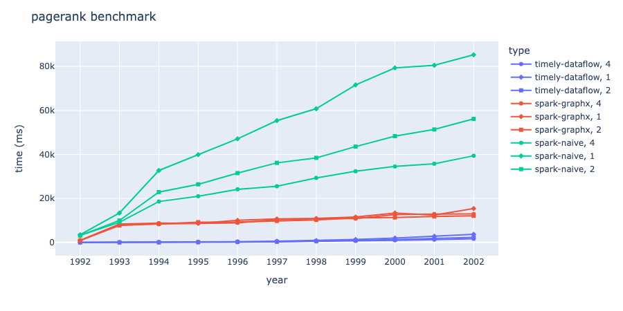
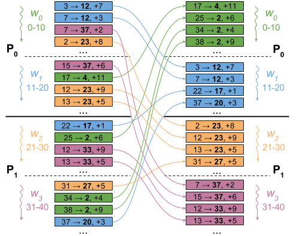
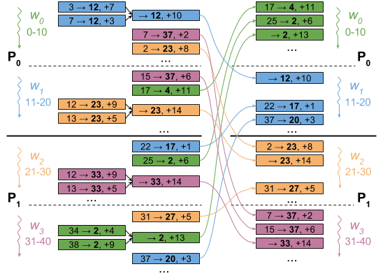
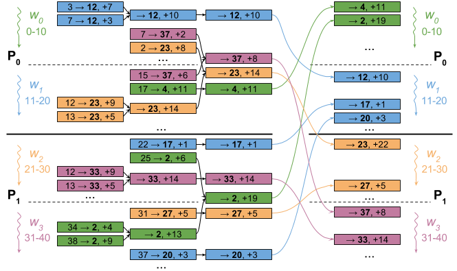

# PageRank

## PageRank results

[pagerank-benchmark-data](./visualization/benchmark/benchmark.json)

| type            | worker | tolerance | damping_factor | year | iteration_times_to_convergence | time_in_ms |
| --------------- | ------ | --------- | -------------- | ---- | ------------------------------ | ---------- |
| spark-naive     | 1      | 1e-10     | 0.85           | 2002 | 50                             | 85328      |
| spark-naive     | 1      | 1e-10     | 0.85           | 2001 | 50                             | 80545      |
| spark-naive     | 1      | 1e-10     | 0.85           | 2000 | 50                             | 79341      |
| spark-naive     | 1      | 1e-10     | 0.85           | 1999 | 50                             | 71626      |
| spark-naive     | 1      | 1e-10     | 0.85           | 1998 | 48                             | 60798      |
| spark-naive     | 1      | 1e-10     | 0.85           | 1997 | 48                             | 55396      |
| spark-naive     | 1      | 1e-10     | 0.85           | 1996 | 48                             | 47100      |
| spark-naive     | 1      | 1e-10     | 0.85           | 1995 | 46                             | 39920      |
| spark-naive     | 1      | 1e-10     | 0.85           | 1994 | 45                             | 32703      |
| spark-naive     | 1      | 1e-10     | 0.85           | 1993 | 28                             | 13366      |
| spark-naive     | 1      | 1e-10     | 0.85           | 1992 | 5                              | 3467       |
| spark-naive     | 2      | 1e-10     | 0.85           | 2002 | 50                             | 56149      |
| spark-naive     | 2      | 1e-10     | 0.85           | 2001 | 50                             | 51364      |
| spark-naive     | 2      | 1e-10     | 0.85           | 2000 | 50                             | 48336      |
| spark-naive     | 2      | 1e-10     | 0.85           | 1999 | 50                             | 43575      |
| spark-naive     | 2      | 1e-10     | 0.85           | 1998 | 48                             | 38434      |
| spark-naive     | 2      | 1e-10     | 0.85           | 1997 | 48                             | 36181      |
| spark-naive     | 2      | 1e-10     | 0.85           | 1996 | 48                             | 31513      |
| spark-naive     | 2      | 1e-10     | 0.85           | 1995 | 46                             | 26417      |
| spark-naive     | 2      | 1e-10     | 0.85           | 1994 | 45                             | 22897      |
| spark-naive     | 2      | 1e-10     | 0.85           | 1993 | 28                             | 9996       |
| spark-naive     | 2      | 1e-10     | 0.85           | 1992 | 5                              | 3084       |
| spark-naive     | 4      | 1e-10     | 0.85           | 2002 | 50                             | 39403      |
| spark-naive     | 4      | 1e-10     | 0.85           | 2001 | 50                             | 35784      |
| spark-naive     | 4      | 1e-10     | 0.85           | 2000 | 50                             | 34542      |
| spark-naive     | 4      | 1e-10     | 0.85           | 1999 | 50                             | 32340      |
| spark-naive     | 4      | 1e-10     | 0.85           | 1998 | 48                             | 29334      |
| spark-naive     | 4      | 1e-10     | 0.85           | 1997 | 48                             | 25546      |
| spark-naive     | 4      | 1e-10     | 0.85           | 1996 | 48                             | 24141      |
| spark-naive     | 4      | 1e-10     | 0.85           | 1995 | 46                             | 20993      |
| spark-naive     | 4      | 1e-10     | 0.85           | 1994 | 45                             | 18583      |
| spark-naive     | 4      | 1e-10     | 0.85           | 1993 | 28                             | 9156       |
| spark-naive     | 4      | 1e-10     | 0.85           | 1992 | 5                              | 3218       |
| spark-graphx    | 1      | 1e-10     | 0.85           | 2002 | 50                             | 15382      |
| spark-graphx    | 1      | 1e-10     | 0.85           | 2001 | 50                             | 12453      |
| spark-graphx    | 1      | 1e-10     | 0.85           | 2000 | 50                             | 13387      |
| spark-graphx    | 1      | 1e-10     | 0.85           | 1999 | 50                             | 11528      |
| spark-graphx    | 1      | 1e-10     | 0.85           | 1998 | 48                             | 10902      |
| spark-graphx    | 1      | 1e-10     | 0.85           | 1997 | 48                             | 10693      |
| spark-graphx    | 1      | 1e-10     | 0.85           | 1996 | 48                             | 10048      |
| spark-graphx    | 1      | 1e-10     | 0.85           | 1995 | 46                             | 8650       |
| spark-graphx    | 1      | 1e-10     | 0.85           | 1994 | 45                             | 8430       |
| spark-graphx    | 1      | 1e-10     | 0.85           | 1993 | 28                             | 8172       |
| spark-graphx    | 1      | 1e-10     | 0.85           | 1992 | 5                              | 918        |
| spark-graphx    | 2      | 1e-10     | 0.85           | 2002 | 50                             | 12077      |
| spark-graphx    | 2      | 1e-10     | 0.85           | 2001 | 50                             | 11805      |
| spark-graphx    | 2      | 1e-10     | 0.85           | 2000 | 50                             | 11348      |
| spark-graphx    | 2      | 1e-10     | 0.85           | 1999 | 50                             | 11168      |
| spark-graphx    | 2      | 1e-10     | 0.85           | 1998 | 48                             | 10221      |
| spark-graphx    | 2      | 1e-10     | 0.85           | 1997 | 48                             | 9768       |
| spark-graphx    | 2      | 1e-10     | 0.85           | 1996 | 48                             | 9254       |
| spark-graphx    | 2      | 1e-10     | 0.85           | 1995 | 46                             | 9211       |
| spark-graphx    | 2      | 1e-10     | 0.85           | 1994 | 45                             | 8377       |
| spark-graphx    | 2      | 1e-10     | 0.85           | 1993 | 28                             | 7682       |
| spark-graphx    | 2      | 1e-10     | 0.85           | 1992 | 5                              | 864        |
| spark-graphx    | 4      | 1e-10     | 0.85           | 2002 | 50                             | 12928      |
| spark-graphx    | 4      | 1e-10     | 0.85           | 2001 | 50                             | 12915      |
| spark-graphx    | 4      | 1e-10     | 0.85           | 2000 | 50                             | 12660      |
| spark-graphx    | 4      | 1e-10     | 0.85           | 1999 | 50                             | 10841      |
| spark-graphx    | 4      | 1e-10     | 0.85           | 1998 | 48                             | 10781      |
| spark-graphx    | 4      | 1e-10     | 0.85           | 1997 | 48                             | 10352      |
| spark-graphx    | 4      | 1e-10     | 0.85           | 1996 | 48                             | 8915       |
| spark-graphx    | 4      | 1e-10     | 0.85           | 1995 | 46                             | 8681       |
| spark-graphx    | 4      | 1e-10     | 0.85           | 1994 | 45                             | 8766       |
| spark-graphx    | 4      | 1e-10     | 0.85           | 1993 | 28                             | 8356       |
| spark-graphx    | 4      | 1e-10     | 0.85           | 1992 | 5                              | 873        |
| timely-dataflow | 1      | 1e-10     | 0.85           | 2002 | 50                             | 3682       |
| timely-dataflow | 1      | 1e-10     | 0.85           | 2001 | 50                             | 2821       |
| timely-dataflow | 1      | 1e-10     | 0.85           | 2000 | 50                             | 1983       |
| timely-dataflow | 1      | 1e-10     | 0.85           | 1999 | 50                             | 1313       |
| timely-dataflow | 1      | 1e-10     | 0.85           | 1998 | 48                             | 841        |
| timely-dataflow | 1      | 1e-10     | 0.85           | 1997 | 48                             | 518        |
| timely-dataflow | 1      | 1e-10     | 0.85           | 1996 | 48                             | 300        |
| timely-dataflow | 1      | 1e-10     | 0.85           | 1995 | 46                             | 157        |
| timely-dataflow | 1      | 1e-10     | 0.85           | 1994 | 45                             | 63         |
| timely-dataflow | 1      | 1e-10     | 0.85           | 1993 | 28                             | 16         |
| timely-dataflow | 1      | 1e-10     | 0.85           | 1992 | 5                              | 1          |
| timely-dataflow | 2      | 1e-10     | 0.85           | 2002 | 50                             | 2291       |
| timely-dataflow | 2      | 1e-10     | 0.85           | 2001 | 50                             | 1782       |
| timely-dataflow | 2      | 1e-10     | 0.85           | 2000 | 50                             | 1286       |
| timely-dataflow | 2      | 1e-10     | 0.85           | 1999 | 50                             | 890        |
| timely-dataflow | 2      | 1e-10     | 0.85           | 1998 | 48                             | 589        |
| timely-dataflow | 2      | 1e-10     | 0.85           | 1997 | 48                             | 346        |
| timely-dataflow | 2      | 1e-10     | 0.85           | 1996 | 48                             | 209        |
| timely-dataflow | 2      | 1e-10     | 0.85           | 1995 | 46                             | 108        |
| timely-dataflow | 2      | 1e-10     | 0.85           | 1994 | 45                             | 48         |
| timely-dataflow | 2      | 1e-10     | 0.85           | 1993 | 28                             | 12         |
| timely-dataflow | 2      | 1e-10     | 0.85           | 1992 | 5                              | 1          |
| timely-dataflow | 4      | 1e-10     | 0.85           | 2002 | 50                             | 1657       |
| timely-dataflow | 4      | 1e-10     | 0.85           | 2001 | 50                             | 1270       |
| timely-dataflow | 4      | 1e-10     | 0.85           | 2000 | 50                             | 965        |
| timely-dataflow | 4      | 1e-10     | 0.85           | 1999 | 50                             | 687        |
| timely-dataflow | 4      | 1e-10     | 0.85           | 1998 | 48                             | 471        |
| timely-dataflow | 4      | 1e-10     | 0.85           | 1997 | 48                             | 297        |
| timely-dataflow | 4      | 1e-10     | 0.85           | 1996 | 48                             | 184        |
| timely-dataflow | 4      | 1e-10     | 0.85           | 1995 | 46                             | 106        |
| timely-dataflow | 4      | 1e-10     | 0.85           | 1994 | 45                             | 42         |
| timely-dataflow | 4      | 1e-10     | 0.85           | 1993 | 28                             | 14         |
| timely-dataflow | 4      | 1e-10     | 0.85           | 1992 | 5                              | 4          |

## Explanation of the observed behavior

It is difficult to compare the performance of the PageRank algorithms implemented in Spark GraphX, Spark without GraphX, and Rust Timely Dataflow without further information about the specific hardware and network environments and the size and structure of the input graph. However, we can make some general observations about how these factors might affect the performance of the algorithms.

In terms of the hardware and network environment, the number of worker nodes and the size and structure of the input graph are likely to have the greatest impact on the performance of the algorithms. In general, increasing the number of worker nodes can improve the performance of distributed algorithms by allowing them to process more data in parallel. However, the performance gains from increasing the number of worker nodes may be limited by the size and structure of the input graph, as well as by the limitations of the network and the communication overhead associated with distributing the data and coordinating the computation among the workers.

With respect to the input graph, the size and structure of the graph can affect the performance of the algorithms in several ways. For example, a larger graph may require more computation and memory to process, and a dense graph (i.e., one with many edges) may have more complex dependencies between nodes and require more communication among the workers. On the other hand, a sparse graph (i.e., one with few edges) may be easier to process and require less communication, but may also have less influence on the PageRank scores of the nodes.

Given these factors, we can expect that the performance of the PageRank algorithms implemented in Spark GraphX, Spark without GraphX, and Rust Timely Dataflow will vary depending on the specific hardware and network environment and the size and structure of the input graph. In general, The Spark GraphX ​​implementation is likely to be more performant than the non-optimized Spark implementation, because GraphX ​​provides optimized algorithms and data structures for graph computation. The Rust Timely Dataflow implementation may also have performance advantages over the Spark implementations because Time is for Dataflow implementations be high-performance computing and has mechanisms for efficient data distribution and coordination among the workers. However, the specific performance characteristics of the algorithms will depend on the details of the hardware and network environment and the size and structure of the input graph.

In terms of the PageRank algorithm itself, all three implementations use a similar approach to compute the PageRank scores for the nodes in a graph. They all initialize the PageRank scores to 1.0 for all nodes, and then iteratively update the scores based on the contributions of each edge to the PageRank scores of the destination nodes. The main difference between the implementations is in the specific data structures and operations they use to represent and manipulate the input graph and compute the PageRank scores. The Spark GraphX and Timely Dataflow implementations use directed graphs and iterative operators, respectively, to compute the PageRank scores, while the non-optimized Spark implementation uses RDDs (Resilient Distributed Datasets) and transformations to represent and manipulate the input graph.

From our tests, we could see that Rust timely dataflow has the best performance, followed by Spark GraphX, and Spark Naive has the worst performance. This should be reason by ranks needs to be broadcast and join in each iteration.

It is worth mentioning that our current test environment is only for multiple workers (1,2,4) using a single machine. For a cluster environment composed of multiple hosts, we have some other optimizations that could be done. Frank McSherry mentioned several IO/network optimizations in his [The impact of Fast networks on graph analytics Blog](http://www.frankmcsherry.org/pagerank/distributed/performance/2015/07/08/pagerank.html), which should be expressed by the following three figures.

pagerank-naive

pagerank-worker-agg

pagerank-process-agg

## References

- [Spark GraphX PageRank](https://spark.apache.org/docs/1.6.1/api/java/org/apache/spark/graphx/lib/PageRank.html)
- [Spark PageRank Example](https://github.com/apache/spark/blob/master/examples/src/main/scala/org/apache/spark/examples/SparkPageRank.scala)
- [The impact of fast networks on graph analytics](http://www.frankmcsherry.org/pagerank/distributed/performance/2015/07/08/pagerank.html)
- [PageRank Online](https://memgraph.com/docs/mage/query-modules/cpp/pagerank-online)
- [Fast Incremental and Personalized PageRank](http://snap.stanford.edu/class/cs224w-readings/bahmani10pagerank.pdf)
- [Dynamic PageRank On Streaming Data](https://memgraph.com/blog/dynamic-page-rank-on-streaming-data)
- [Twitter-analysis-with-dynamic-pagerank](https://memgraph.com/blog/twitter-analysis-with-dynamic-pagerank)
- [PageRank Online CPP](https://github.com/memgraph/mage/blob/main/cpp/pagerank_module/algorithm_online/pagerank.cpp)
- [Fast Incremental PageRank On Dynamic Networks](http://web.geni-pco.com/icwe2019/3_Fast_Incremental_PageRank_on_Dynamic_Networks.pdf)
- [Timely-Dataflow](https://timelydataflow.github.io/timely-dataflow/)
- [Life In Differential Dataflow](https://materialize.com/blog/life-in-differential-dataflow/)
- [Naiad: A timely dataflow system for batch and stream processing](https://courses.engr.illinois.edu/cs525/sp2016/Naiad%20Presentation.pdf)
- [Timely Dataflow PageRank 0](https://github.com/frankmcsherry/blog/blob/master/posts/2017-08-21.md)
